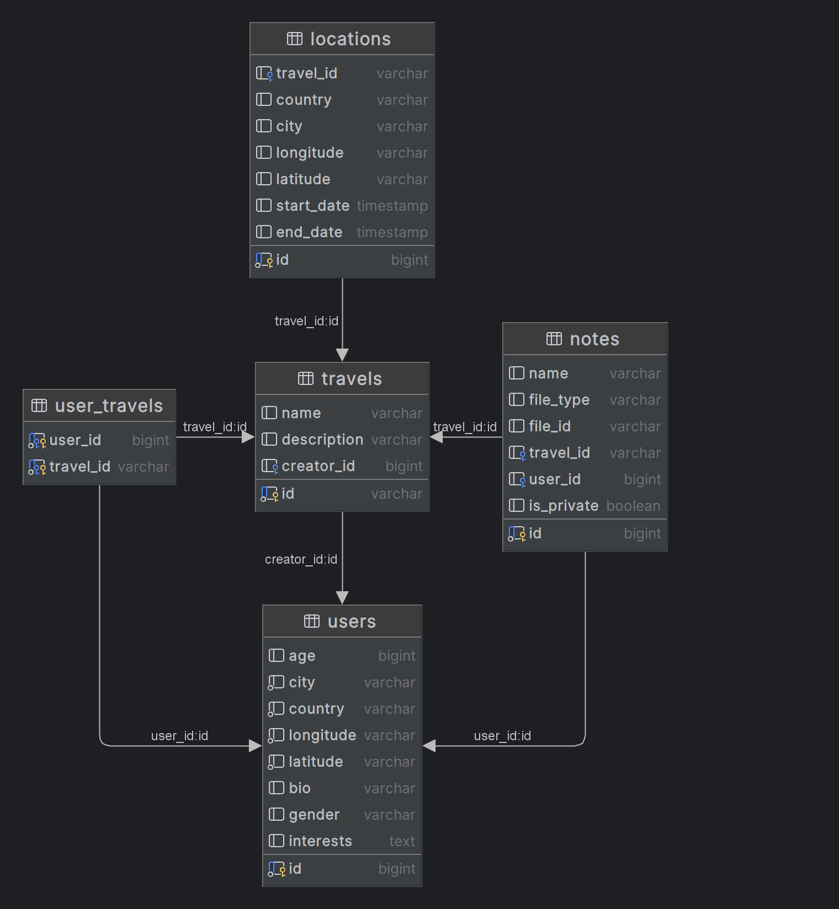

# Схема данных СУБД

## users
Основополагающая таблица для хранения данных о пользователях бота
* id — основной ключ, bigint, принимает значение Telegram User ID
* age — bigint, возраст пользователя
* country — string, страна пользователя
* city — string, город пользователя
* latitude — string, широта местоположения
* longitude — string, долгота местоположения
* bio — string, поле «о себе»
* interests — array(string), интересы пользователя
* gender — string, пол (male / female / other) пользователя

## travels
Таблица для хранения базовых данных о путешествиях
* id — основной ключ, string, uuid4, генерируется при создании записи
* creator_id — внешний ключ -> users.id, bigint, идентификатор создателя путешествия
* name — string, название путешествия
* description — string, описание путешествия

## user_travels
Таблица, предназначенная для связи users и travels (иными словами, для хранения списков участников путешествий)
* user_id — внешний ключ -> users.id, bigint, идентификатор участника путешествия
* travel_id — внешний ключ -> travels.id, string, идентификатор путешествия

## locations
Таблица для хранения локаций, которые необходимо посетить во время путешествия
* id — основной ключ, bigint, генерируется при создании записи 
* travel_id — внешний ключ -> travels.id, string, идентификатор путешествия
* country — string, страна пользователя
* city — string, город пользователя
* latitude — string, широта местоположения
* longitude — string, долгота местоположения
* start_date — datetime, дата начала посещения локации
* end_date — datetime, дата завершения посещения локации

## notes
Таблица для хранения заметок к путешествиям
* id — основной ключ, bigint, генерируется при создании записи
* travel_id — внешний ключ -> travels.id, string, идентификатор путешествия
* user_id — внешний ключ -> users.id, bigint, идентификатор создателя заметки
* name — string, название заметки
* file_type — string, тип файла (photo / video / document)
* file_id — string, уникальный идентификатор файла, получаемый от Telegram
* is_private — bool, признак того, является ли заметка доступна для просмотра только её создателю 